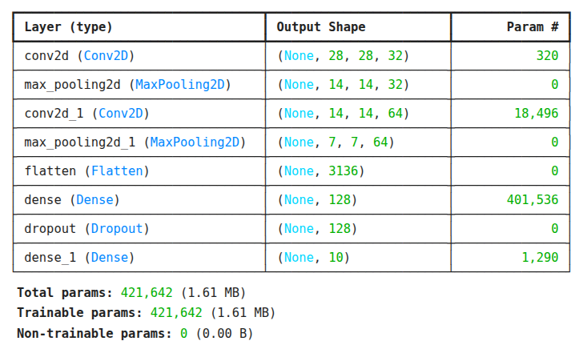
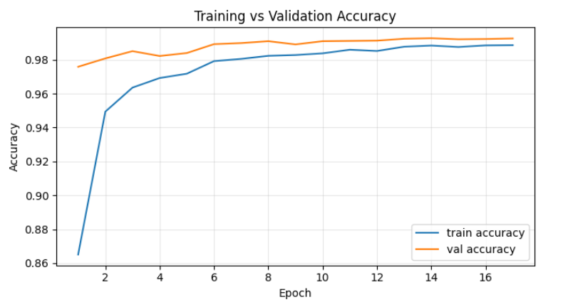
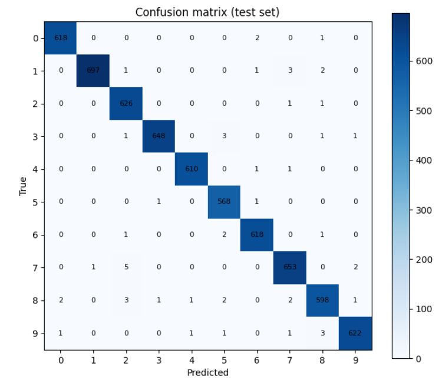

# CNN Digit Classifier (MNIST-as-JPG)

Train a small TensorFlow/Keras CNN to classify handwritten digits **0–9** from **grayscale JPGs on disk**.

## Kaggle

- **Dataset**:
  [https://www.kaggle.com/datasets/scolianni/mnistasjpg](https://www.kaggle.com/datasets/scolianni/mnistasjpg)
- **Notebook**:
  [https://www.kaggle.com/code/mehrabgheibi/cnn-digit-classifier-test-99](https://www.kaggle.com/code/mehrabgheibi/cnn-digit-classifier-test-99)

## Highlights

- **Backbone**: compact custom CNN (Conv2D/MaxPool) for 28×28×1 grayscale inputs
- **Workflow**: step-by-step notebook in `cnn-digit-classifier-mnist-jpg.ipynb`
- **Input pipeline**: `tf.data` (read/decode JPG → resize **28×28** → rescale **[0,1]** → one-hot labels)
- **Split**: stratified **70/15/15** train/val/test split per digit folder (`0..9`), with a disjointness check
- **Augmentation**: train-only rotation/translation/zoom
- **Training**: Adam + categorical cross-entropy, with ModelCheckpoint (best `val_accuracy`)/EarlyStopping/ReduceLROnPlateau
- **Evaluation**: held-out test set + confusion matrix

## Sample images

<table width="100%">
  <tr>
    <td width="33%">
      
    </td>
    <td width="33%">
      
    </td>
    <td width="33%">
      
    </td>
  </tr>
</table>

## Dataset

- **Kaggle dataset**: [https://www.kaggle.com/datasets/scolianni/mnistasjpg](https://www.kaggle.com/datasets/scolianni/mnistasjpg)

Expected folder layout:

```text
DATA_DIR/
  0/*.jpg
  1/*.jpg
  ...
  9/*.jpg
```

## Run (Kaggle) — recommended

1. Create a Kaggle notebook.
2. Add the dataset: [https://www.kaggle.com/datasets/scolianni/mnistasjpg](https://www.kaggle.com/datasets/scolianni/mnistasjpg)
3. Open the notebook:
   [https://www.kaggle.com/code/mehrabgheibi/cnn-digit-classifier-test-99](https://www.kaggle.com/code/mehrabgheibi/cnn-digit-classifier-test-99)
   (or upload/run `cnn-digit-classifier-mnist-jpg.ipynb`).
4. Ensure `DATA_DIR` points to the dataset folder containing the digit subfolders `0..9` (the notebook uses a Kaggle path by default).

## Model summary

A compact CNN for 28×28×1 inputs:

- `Conv2D(32)` → `MaxPool`
- `Conv2D(64)` → `MaxPool`
- `Flatten` → `Dense(128)` → `Dropout(0.3)`
- `Dense(10, softmax)`



## Training curves

Train vs validation **accuracy** across epochs:



## Evaluation (held-out test set)

The saved best model is evaluated on the held-out test set (no augmentation). Results are visualized with a confusion matrix.


